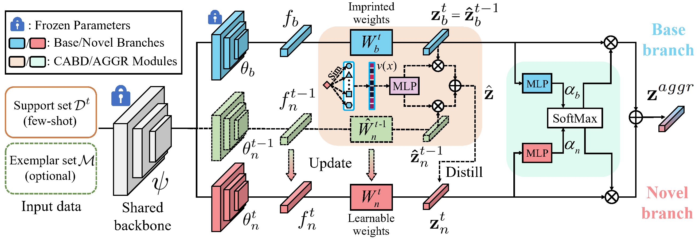

# [CVPR2023] Few-Shot Class-Incremental Learning via Class-Aware Bilateral Distillation

## Requirements
- [PyTorch >= version 1.4](https://pytorch.org)
- tqdm

## Datasets
We follow [FSCIL](https://github.com/xyutao/fscil) setting to use the same data index_list for training. 
Please follow the guidelines in [CEC](https://github.com/icoz69/CEC-CVPR2021) to prepare them.
Scripts for experiments on mini-imagenet are as follows, and the full codes will be available upon acceptance:

## Pretrain scripts 
mini-imagenet (We also provide our [pre-trained model](https://drive.google.com/file/d/1c9uMcDJLXseHxFT9Xw234dVE648Mk7ti/view?usp=sharing) so this step is optional.)

    $ python train.py --dataset mini-imagenet --exp_dir experiment --epoch 200 --batch_size 256 --init_lr 0.1 --milestones 120 160 --val_start 100 --change_val_interval 160

## Testing scripts    
mini-imagenet

    $ python test.py --dataset mini-imagenet --exp_dir experiment --needs_finetune --ft_iters 100 --ft_lr 0.001 --ft_factor 1.0 --ft_T 16 --w_d 100 --part_frozen --ft_KD_all --ft_teacher fixed --bilateral --BC_hidden_dim 64 --BC_lr 0.01 --w_BC_binary 50 --EMA_logits --w_l 1 --EMA_FC_lr 0.01

## Acknowledgment
Our project references the codes in the following repos.

- [fscil](https://github.com/xyutao/fscil)
- [CEC](https://github.com/icoz69/CEC-CVPR2021)
- [FACT](https://github.com/zhoudw-zdw/CVPR22-Fact)
